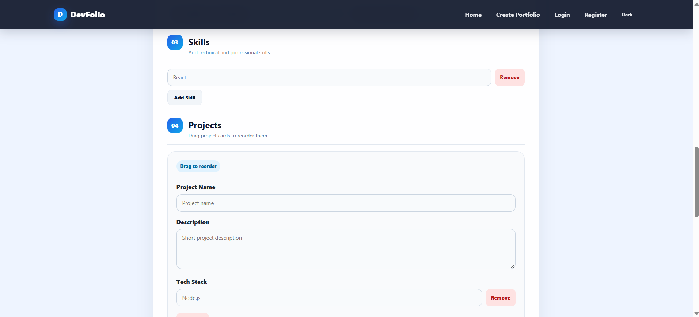
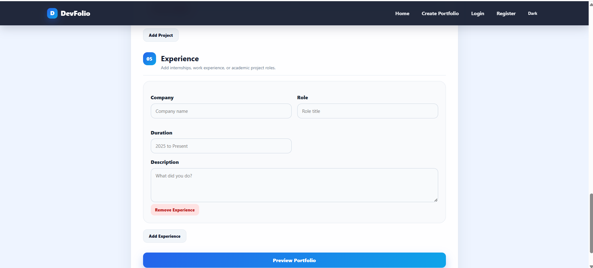

# DevFolio Generator

DevFolio Generator is a full stack MERN web application that allows developers to create, preview, publish, edit, and share a professional portfolio through a unique public URL.

The application supports both manual form input and CV PDF import. Users can upload a CV to auto fill portfolio details, review and edit the imported data, preview the final layout, and then publish the portfolio.

## Repository

```txt
https://github.com/sxhiru0725/DevFolio-Generator
```

## Project Objective

The goal of this project is to build a full stack portfolio generator where users can enter portfolio information through a form and generate a public portfolio page.

The application saves portfolio data to MongoDB and renders each portfolio dynamically using a unique username based URL.

Example public portfolio route:

```txt
http://localhost:5173/portfolio/imadith
```

## Features

### Core Features

```txt
Home page with platform introduction
Create portfolio form
Manual data input
CV PDF import and auto fill
Portfolio preview before publishing
Public portfolio page with unique URL
Edit existing portfolio
MongoDB data storage
REST API with Express.js
Dynamic skills input
Dynamic projects input
Experience section
Contact links section
Responsive professional UI
Duplicate username handling
View count tracking
```

### Bonus Features Added

```txt
CV PDF import and auto fill
Manual form input
Resume PDF URL support
Cloudinary resume PDF upload
Portfolio view count analytics
JWT authentication with register and login
Dark and light mode toggle
Portfolio theme selection
Drag and drop project ordering
Professional responsive UI styling
Public API response testing
```

## Tech Stack

### Frontend

```txt
React.js
React Router
Axios
Vite
CSS
pdfjs-dist
```

### Backend

```txt
Node.js
Express.js
MongoDB
Mongoose
CORS
dotenv
Nodemon
JWT
bcryptjs
multer
Cloudinary
```

### Database

```txt
MongoDB local database
Mongoose schema validation
```

## Folder Structure

```txt
DevFolio-Generator
|
|-- client
|   |-- src
|   |   |-- api
|   |   |   |-- authApi.js
|   |   |   |-- portfolioApi.js
|   |   |   |-- uploadApi.js
|   |   |
|   |   |-- components
|   |   |   |-- Navbar.jsx
|   |   |   |-- PortfolioDisplay.jsx
|   |   |   |-- PortfolioForm.jsx
|   |   |
|   |   |-- context
|   |   |   |-- AuthContext.jsx
|   |   |   |-- ThemeContext.jsx
|   |   |
|   |   |-- pages
|   |   |   |-- Home.jsx
|   |   |   |-- CreatePortfolio.jsx
|   |   |   |-- PreviewPortfolio.jsx
|   |   |   |-- PublicPortfolio.jsx
|   |   |   |-- EditPortfolio.jsx
|   |   |   |-- Login.jsx
|   |   |   |-- Register.jsx
|   |   |
|   |   |-- utils
|   |   |   |-- cvParser.js
|   |   |
|   |   |-- App.jsx
|   |   |-- main.jsx
|   |   |-- index.css
|   |
|   |-- package.json
|
|-- server
|   |-- config
|   |   |-- db.js
|   |
|   |-- controllers
|   |   |-- authController.js
|   |   |-- portfolioController.js
|   |   |-- uploadController.js
|   |
|   |-- middleware
|   |   |-- authMiddleware.js
|   |
|   |-- models
|   |   |-- Portfolio.js
|   |   |-- User.js
|   |
|   |-- routes
|   |   |-- authRoutes.js
|   |   |-- portfolioRoutes.js
|   |   |-- uploadRoutes.js
|   |
|   |-- server.js
|   |-- package.json
|
|-- screenshots
|-- README.md
|-- .env.example
|-- .gitignore
```

## Environment Variables

Create a `.env` file inside the `server` folder.

```txt
PORT=5000
MONGO_URI=mongodb://127.0.0.1:27017/portfolio_generator
JWT_SECRET=replace_this_with_a_long_secret_key
CLOUDINARY_CLOUD_NAME=your_cloudinary_cloud_name
CLOUDINARY_API_KEY=your_cloudinary_api_key
CLOUDINARY_API_SECRET=your_cloudinary_api_secret
NODE_ENV=development
```

Example location:

```txt
server/.env
```

Do not push `.env` to GitHub. Use `.env.example` for showing the required environment variables.

## Installation and Setup

### Prerequisites

Install these before running the project:

```txt
Node.js
npm
MongoDB Community Server
Git
```

## Run the Project Locally

### 1. Clone the Repository

```powershell
git clone https://github.com/sxhiru0725/DevFolio-Generator.git
cd DevFolio-Generator
```

### 2. Start MongoDB

Open PowerShell as Administrator and run:

```powershell
net start MongoDB
```

If MongoDB is already running, you may see a message saying the service has already been started. That is fine.

### 3. Install and Run Backend

```powershell
cd server
npm install
npm run dev
```

Backend should run on:

```txt
http://localhost:5000
```

Expected backend response:

```json
{
  "success": true,
  "message": "Developer Portfolio Generator API is running"
}
```

### 4. Install and Run Frontend

Open a second terminal:

```powershell
cd client
npm install
npm run dev
```

Frontend should run on:

```txt
http://localhost:5173
```

## API Endpoints

### Portfolio API

| Method | Endpoint | Description |
|---|---|---|
| POST | `/api/portfolio` | Create a new portfolio |
| GET | `/api/portfolio/:username` | Fetch portfolio by username |
| PUT | `/api/portfolio/:username` | Update existing portfolio |
| DELETE | `/api/portfolio/:username` | Delete portfolio |

### Authentication API

| Method | Endpoint | Description |
|---|---|---|
| POST | `/api/auth/register` | Register a new user |
| POST | `/api/auth/login` | Login user and return JWT token |
| GET | `/api/auth/me` | Get logged in user details |

### Upload API

| Method | Endpoint | Description |
|---|---|---|
| POST | `/api/upload/resume` | Upload resume PDF to Cloudinary |

## Example API Test

Open this in the browser:

```txt
http://localhost:5000/api/portfolio/imadith
```

Successful response example:

```json
{
  "success": true,
  "data": {
    "username": "imadith",
    "fullName": "Sahiru Imadith",
    "title": "Full Stack Developer",
    "skills": ["HTML", "CSS", "JavaScript", "React", "Node.js"]
  }
}
```

## Application Pages

| Page | Route | Description |
|---|---|---|
| Home | `/` | Landing page introducing the app |
| Create Portfolio | `/create` | Multi section portfolio form |
| Preview Portfolio | `/preview` | Read only preview before publishing |
| Public Portfolio | `/portfolio/:username` | Public portfolio page |
| Edit Portfolio | `/edit/:username` | Edit existing portfolio |
| Login | `/login` | User login page |
| Register | `/register` | User registration page |

## How to Use the App

### Manual Portfolio Creation

```txt
1. Open the frontend at http://localhost:5173
2. Click Create Portfolio
3. Fill in personal details, contact, skills, projects, and experience
4. Choose a portfolio theme
5. Drag and reorder projects if needed
6. Add a resume URL or upload a resume PDF
7. Click Preview Portfolio
8. Review the portfolio
9. Click Publish Portfolio
10. Open the generated public portfolio URL
```

### CV Import Portfolio Creation

```txt
1. Open Create Portfolio page
2. Upload a PDF CV using the Import from CV section
3. The app extracts data and auto fills the form
4. Review and manually edit any details if needed
5. Click Preview Portfolio
6. Publish the portfolio
```

Important note:

```txt
CV parsing is not always perfect because CV formats are different.
Users should review and edit imported data before publishing.
```

### Resume Upload

```txt
1. Open Create Portfolio page
2. Upload a PDF resume in the Resume Upload section
3. The backend sends the file to Cloudinary
4. The returned Cloudinary link is saved as the portfolio resume URL
```

Cloudinary upload requires valid Cloudinary environment variables in `server/.env`.

## MongoDB Schema

```js
UserPortfolio {
  owner: ObjectId,
  username: String,
  fullName: String,
  title: String,
  bio: String,
  profileImage: String,
  resumeUrl: String,
  theme: String,
  contact: {
    email: String,
    linkedin: String,
    github: String,
    website: String
  },
  skills: [String],
  projects: [
    {
      name: String,
      description: String,
      techStack: [String],
      githubLink: String,
      liveDemo: String
    }
  ],
  experience: [
    {
      company: String,
      role: String,
      duration: String,
      description: String
    }
  ],
  viewCount: Number
}
```

## Screenshots

Add screenshots inside the `screenshots` folder.

### Home Page


### Create Portfolio Page


### CV Import Section


### Create Portfolio Form Continued



### Create Portfolio Form Projects and Experience



### Preview Page


### Public Portfolio Page


### Edit Portfolio Page


### Backend API Response


## Validation and Error Handling

```txt
Required username
Required full name
Unique username check
URL safe username format
Duplicate username error message
CV import error message
Resume upload error message
Portfolio not found handling
Backend API error responses
```

## Known Limitations

```txt
CV import uses basic text extraction and keyword matching.
Some CV layouts may not extract all fields accurately.
Cloudinary resume upload requires valid Cloudinary environment variables.
Authentication is implemented, but portfolio editing is still kept flexible for demo and testing purposes.
Deployment is not included in this local version.
```

## Future Improvements

```txt
Deploy frontend to Vercel
Deploy backend to Render
Improve AI based CV parsing
Add SEO meta tags for portfolio pages
Add stronger ownership protection for editing portfolios
Add dashboard page for logged in users
```

## Testing Checklist

```txt
Home page loads
Create Portfolio page loads
Manual form submission works
CV PDF import works
Resume PDF URL works
Cloudinary resume upload works when Cloudinary keys are configured
Theme selection works
Dark and light mode toggle works
Project drag and drop ordering works
Preview page displays entered data
Publish button saves data to MongoDB
Public portfolio page loads by username
Edit page pre fills existing data
PUT request updates portfolio
Duplicate username shows error
Register page creates user account
Login page returns JWT token
Backend API returns JSON data
MongoDB stores portfolio data
Frontend is responsive on desktop and mobile
```

## Submission Notes

Before submitting, make sure:

```txt
GitHub repository is public
README.md is complete
Screenshots are added
.env is not pushed
node_modules is not pushed
Project has at least 10 meaningful commits
Short 2 to 3 minute walkthrough video is recorded
```

## Author

```txt
Sahiru Imadith Saunda Hennadige
GitHub: https://github.com/sxhiru0725
```