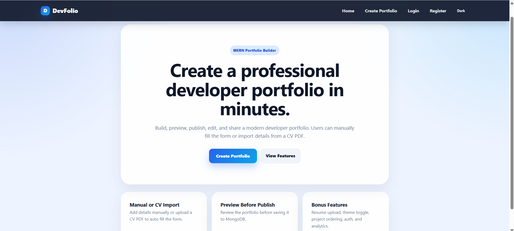
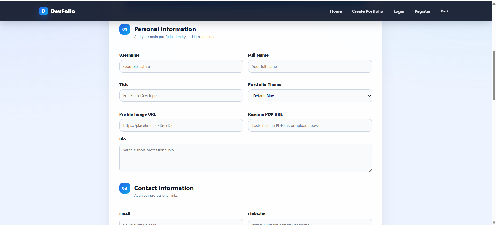
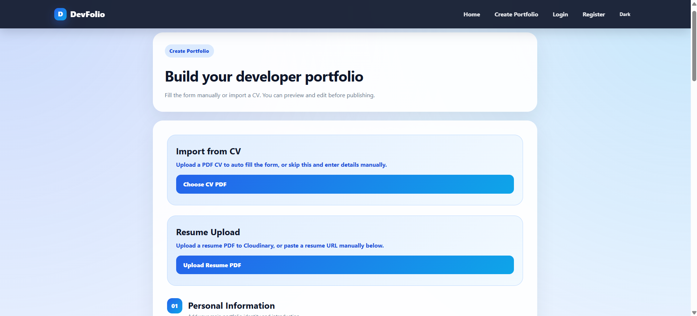
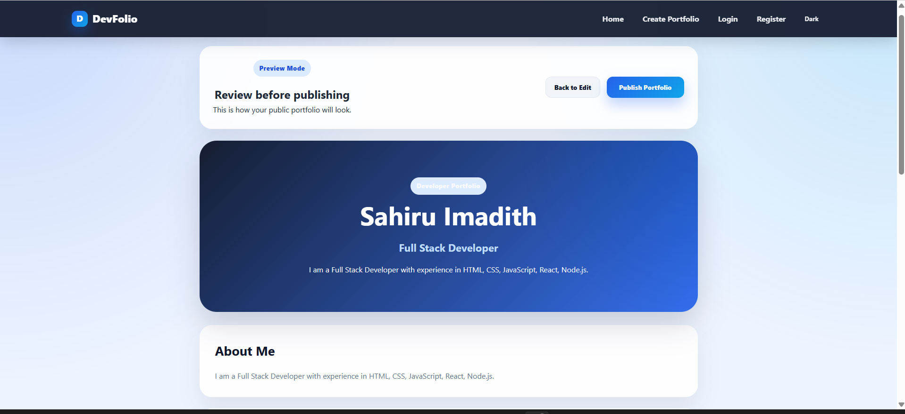
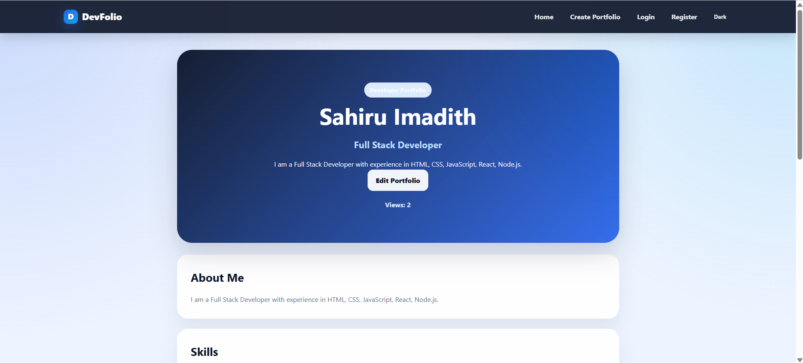
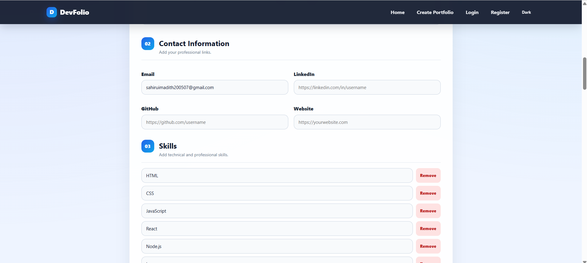
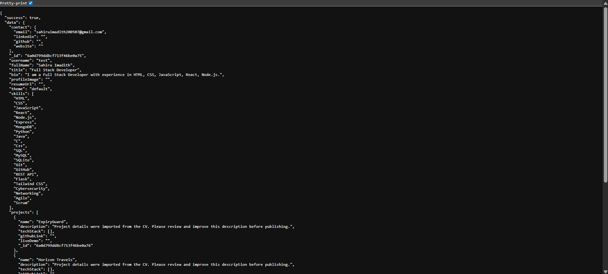

# DevFolio Generator

DevFolio Generator is a full stack MERN web application that allows developers to create, preview, publish, edit, and share a professional portfolio through a unique public URL.

The application supports both manual form entry and CV PDF import. Users can upload a CV to auto fill portfolio details, review and edit the data, preview the final layout, and then publish the portfolio.

## Repository

GitHub Repository:

```txt
https://github.com/sxhiru0725/DevFolio-Generator
```

## Project Objective

The goal of this project is to build a full stack portfolio generator where users can enter their portfolio information through a form and generate a public portfolio page.

The application saves portfolio data to MongoDB and renders each portfolio dynamically using a unique username based URL.

Example public portfolio route:

```txt
http://localhost:5173/portfolio/sahiru3
```

## Features

### Core Features

```txt
Home page with platform introduction
Create portfolio form
Portfolio preview before publishing
Public portfolio page with unique URL
Edit existing portfolio
MongoDB data storage
REST API with Express.js
Dynamic skills input
Dynamic projects input
Experience section
Contact links section
Responsive professional UI
Duplicate username handling
View count tracking
```

### Bonus Features Added

```txt
CV PDF import and auto fill
Resume PDF URL support
Portfolio view count analytics
Professional UI styling
Public API response testing
```

## Tech Stack

### Frontend

```txt
React.js
React Router
Axios
Vite
CSS
pdfjs-dist
```

### Backend

```txt
Node.js
Express.js
MongoDB
Mongoose
CORS
dotenv
Nodemon
```

### Database

```txt
MongoDB local database
Mongoose schema validation
```

## Folder Structure

```txt
DevFolio-Generator
|
|-- client
|   |-- src
|   |   |-- api
|   |   |   |-- portfolioApi.js
|   |   |
|   |   |-- components
|   |   |   |-- Navbar.jsx
|   |   |   |-- PortfolioForm.jsx
|   |   |
|   |   |-- pages
|   |   |   |-- Home.jsx
|   |   |   |-- CreatePortfolio.jsx
|   |   |   |-- PreviewPortfolio.jsx
|   |   |   |-- PublicPortfolio.jsx
|   |   |   |-- EditPortfolio.jsx
|   |   |
|   |   |-- utils
|   |   |   |-- cvParser.js
|   |   |
|   |   |-- App.jsx
|   |   |-- main.jsx
|   |   |-- index.css
|   |
|   |-- package.json
|
|-- server
|   |-- config
|   |   |-- db.js
|   |
|   |-- controllers
|   |   |-- portfolioController.js
|   |
|   |-- models
|   |   |-- Portfolio.js
|   |
|   |-- routes
|   |   |-- portfolioRoutes.js
|   |
|   |-- server.js
|   |-- package.json
|
|-- screenshots
|-- README.md
|-- .gitignore
```

## Environment Variables

Create a `.env` file inside the `server` folder.

```txt
PORT=5000
MONGO_URI=mongodb://127.0.0.1:27017/portfolio_generator
NODE_ENV=development
```

Example location:

```txt
server/.env
```

Do not push `.env` to GitHub.

## Installation and Setup

### Prerequisites

Install these before running the project:

```txt
Node.js
npm
MongoDB Community Server
Git
```

## Run the Project Locally

### 1. Clone the Repository

```powershell
git clone https://github.com/sxhiru0725/DevFolio-Generator.git
cd DevFolio-Generator
```

### 2. Start MongoDB

Open PowerShell as Administrator and run:

```powershell
net start MongoDB
```

If MongoDB is already running, you may see a message saying the service has already been started. That is fine.

### 3. Install and Run Backend

```powershell
cd server
npm install
npm run dev
```

Backend should run on:

```txt
http://localhost:5000
```

Expected backend message:

```txt
Developer Portfolio Generator API is running
```

### 4. Install and Run Frontend

Open a second terminal:

```powershell
cd client
npm install
npm run dev
```

Frontend should run on:

```txt
http://localhost:5173
```

## API Endpoints

| Method | Endpoint | Description |
|---|---|---|
| POST | `/api/portfolio` | Create a new portfolio |
| GET | `/api/portfolio/:username` | Fetch portfolio by username |
| PUT | `/api/portfolio/:username` | Update existing portfolio |
| DELETE | `/api/portfolio/:username` | Delete portfolio |

## Example API Test

Open this in the browser:

```txt
http://localhost:5000/api/portfolio/sahiru3
```

Successful response example:

```json
{
  "success": true,
  "data": {
    "username": "sahiru3",
    "fullName": "Sahiru Imadith",
    "title": "Full Stack Developer",
    "skills": ["HTML", "CSS", "JavaScript", "React", "Node.js"]
  }
}
```

## Application Pages

| Page | Route | Description |
|---|---|---|
| Home | `/` | Landing page introducing the app |
| Create Portfolio | `/create` | Multi section portfolio form |
| Preview Portfolio | `/preview` | Read only preview before publishing |
| Public Portfolio | `/portfolio/:username` | Public portfolio page |
| Edit Portfolio | `/edit/:username` | Edit existing portfolio |

## How to Use the App

### Manual Portfolio Creation

```txt
1. Open the frontend at http://localhost:5173
2. Click Create Portfolio
3. Fill in personal details, contact, skills, projects, and experience
4. Click Preview Portfolio
5. Review the portfolio
6. Click Publish Portfolio
7. Open the generated public portfolio URL
```

### CV Import Portfolio Creation

```txt
1. Open Create Portfolio page
2. Upload a PDF CV using the Import from CV section
3. The app extracts data and auto fills the form
4. Review and manually edit any details if needed
5. Click Preview Portfolio
6. Publish the portfolio
```

Important note:

```txt
CV parsing is not always perfect because CV formats are different.
Users should review and edit imported data before publishing.
```

## MongoDB Schema

```js
UserPortfolio {
  username: String,
  fullName: String,
  title: String,
  bio: String,
  profileImage: String,
  resumeUrl: String,
  contact: {
    email: String,
    linkedin: String,
    github: String,
    website: String
  },
  skills: [String],
  projects: [
    {
      name: String,
      description: String,
      techStack: [String],
      githubLink: String,
      liveDemo: String
    }
  ],
  experience: [
    {
      company: String,
      role: String,
      duration: String,
      description: String
    }
  ],
  viewCount: Number
}
```

## Screenshots

Add your screenshots inside the `screenshots` folder.

Recommended screenshots:

```txt
screenshots/home-page.png
screenshots/create-portfolio-form.png
screenshots/cv-import-section.png
screenshots/preview-page.png
screenshots/public-portfolio-page.png
screenshots/edit-portfolio-page.png
screenshots/backend-api-response.png
```

Then replace the placeholders below after adding screenshots.

### Home Page

```md

```

### Create Portfolio Page

```md

```

### CV Import Section

```md

```

### Preview Page

```md

```

### Public Portfolio Page

```md

```

### Edit Portfolio Page

```md

```

### Backend API Response

```md

```

## Validation and Error Handling

```txt
Required username
Required full name
Unique username check
URL safe username format
Duplicate username error message
CV import error message
Portfolio not found handling
Backend API error responses
```

## Known Limitations

```txt
CV import uses basic text extraction and keyword matching.
Some CV layouts may not extract all fields accurately.
Resume upload currently supports a PDF URL rather than storing files with Cloudinary.
Authentication is not included because it was listed as an optional bonus feature.
```

## Future Improvements

```txt
Cloudinary resume file upload
JWT authentication
Dark and light theme toggle
Drag and drop project ordering
Deployment to Vercel and Render
Improved AI based CV parsing
SEO meta tags for portfolio pages
```

## Testing Checklist

```txt
Home page loads
Create Portfolio page loads
Manual form submission works
CV PDF import works
Preview page displays entered data
Publish button saves data to MongoDB
Public portfolio page loads by username
Edit page pre fills existing data
PUT request updates portfolio
Duplicate username shows error
Backend API returns JSON data
MongoDB stores portfolio data
Frontend is responsive on desktop and mobile
```

## Submission Notes

Before submitting, make sure:

```txt
GitHub repository is public
README.md is complete
Screenshots are added
.env is not pushed
node_modules is not pushed
Project has at least 10 meaningful commits
Short 2 to 3 minute walkthrough video is recorded
```

## Author

```txt
Sahiru Hennadige
GitHub: https://github.com/sxhiru0725
```
